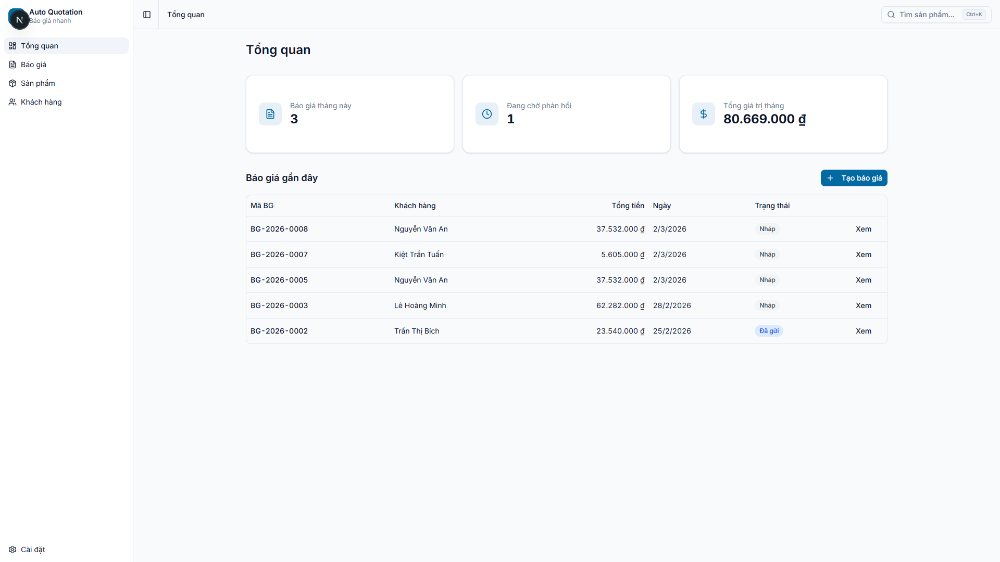
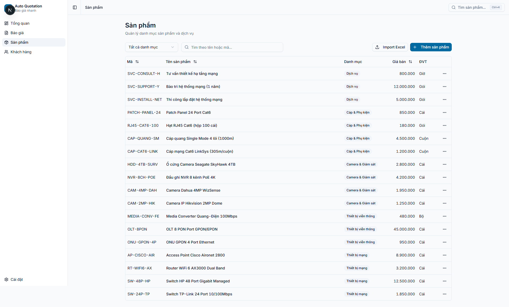
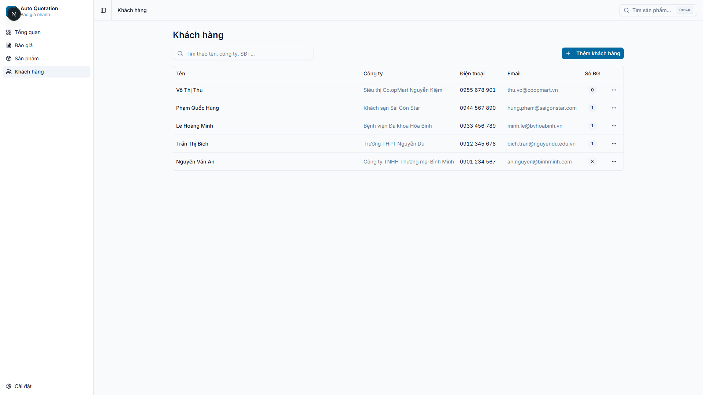
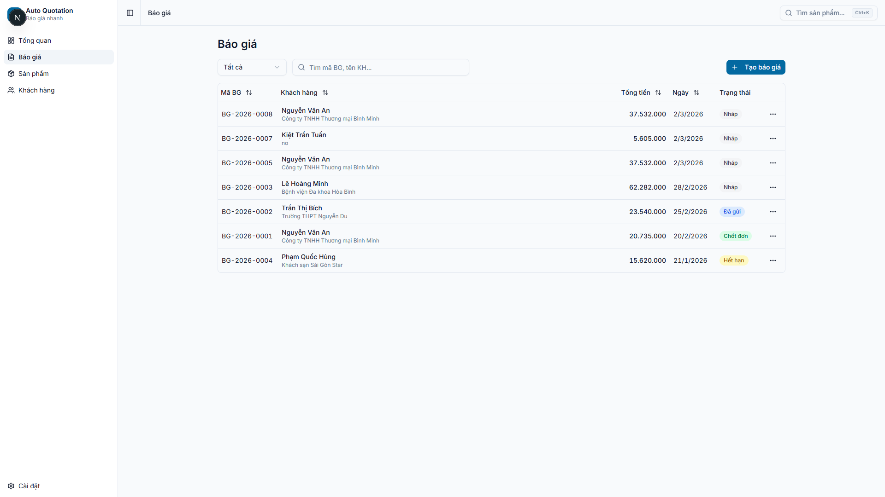
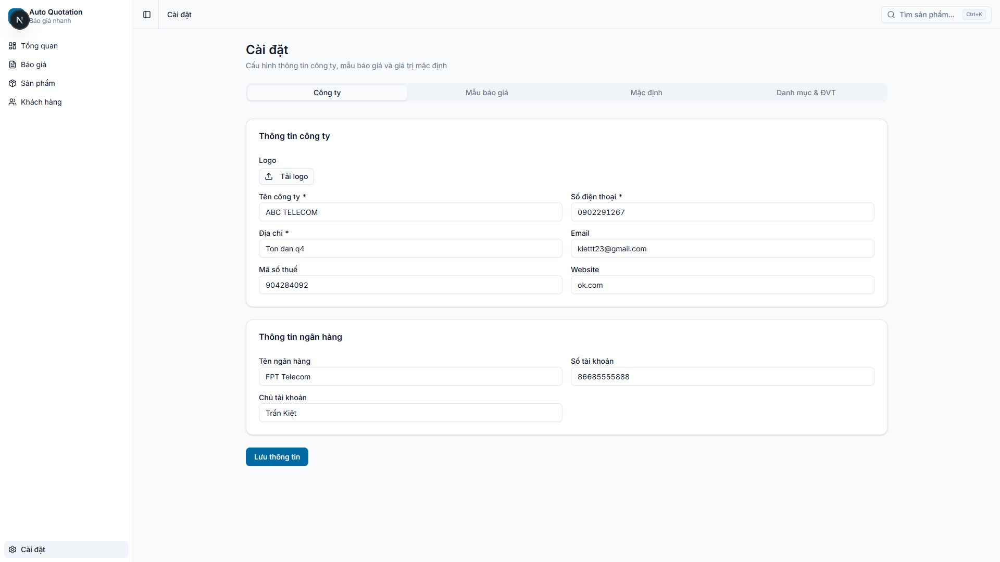
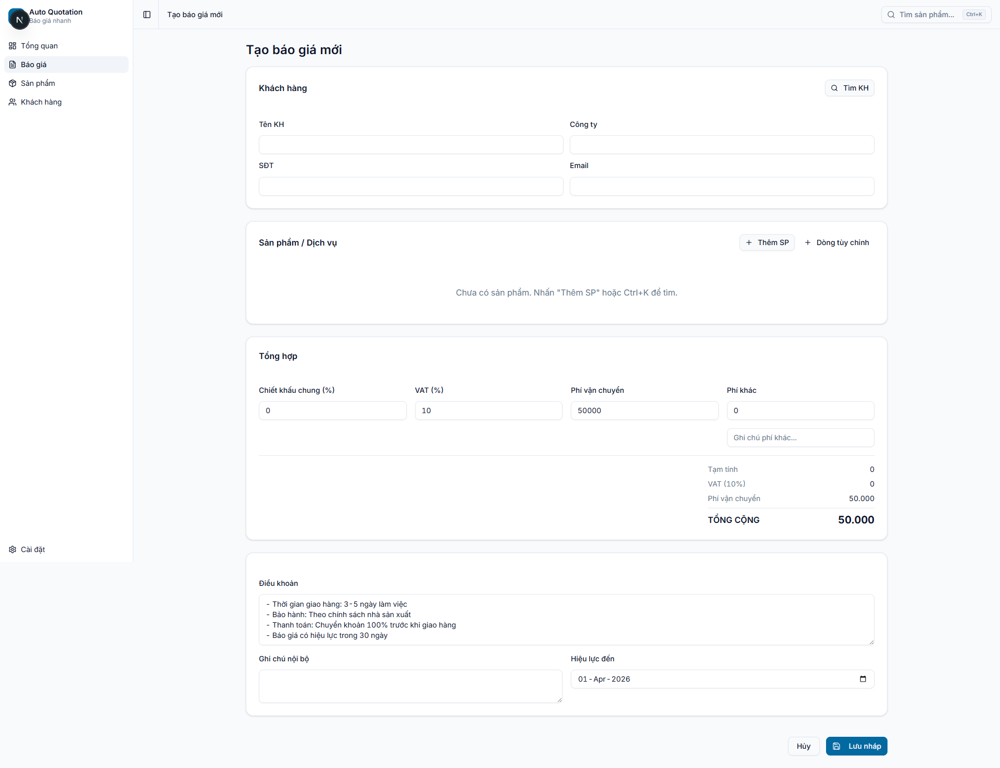
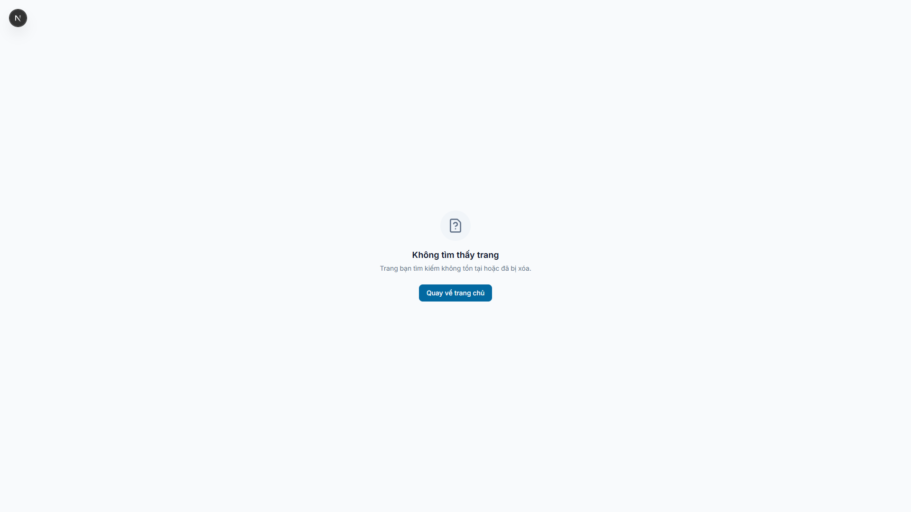

# UI Test Report — Auto Quotation App

**Date:** 2026-03-02
**URL:** http://localhost:3000
**Tool:** Puppeteer (chrome-devtools)
**Viewport:** Desktop 1920x1080 + Mobile 375x812

---

## 1. Test Summary

| Category | Pass | Fail | Warn |
|----------|------|------|------|
| Navigation | 5 | 0 | 0 |
| Page Rendering | 6 | 1 | 0 |
| Forms & Inputs | 4 | 0 | 1 |
| Responsive | 0 | 0 | 3 |
| Performance | 2 | 0 | 1 |
| Accessibility | 3 | 0 | 2 |
| **Total** | **20** | **1** | **7** |

**Overall: PASS with warnings**

---

## 2. Page Screenshots & Analysis

### 2.1 Dashboard (`/`)

- **PASS** — 3 stat cards render correctly (Báo giá tháng này: 3, Đang chờ: 1, Tổng: 80.669.000 đ)
- **PASS** — Recent quotes table shows 5 rows with proper data
- **PASS** — Status badges styled correctly (Nháp = gray, Đã gửi = blue)
- **PASS** — "Tạo báo giá" CTA button visible
- **PASS** — Vietnamese text renders cleanly (no encoding issues)

### 2.2 Products (`/san-pham`)

- **PASS** — Product table with 18 items, all categories visible
- **PASS** — Column headers: Mã, Tên, Danh mục, Đơn giá, ĐVT
- **PASS** — Search bar and filter dropdown functional
- **PASS** — "Thêm sản phẩm" + "Import Excel" buttons visible

### 2.3 Customers (`/khach-hang`)

- **PASS** — 5 customers displayed with name, company, phone, email
- **PASS** — "Số BG" column shows quote count per customer
- **PASS** — Search placeholder "Tìm theo tên, công ty, SĐT..."
- **PASS** — "Thêm khách hàng" button visible

### 2.4 Quotes (`/bao-gia`)

- **PASS** — 7 quotes listed with sorting arrows on columns
- **PASS** — Status filter dropdown ("Tất cả") + search bar
- **PASS** — 4 status types visible: Nháp (gray), Đã gửi (blue), Chốt đơn (green), Hết hạn (orange)
- **PASS** — Customer company shown as subtitle under name
- **PASS** — Actions menu (⋯) on each row

### 2.5 Settings (`/cai-dat`)

- **PASS** — 4 tabs: Công ty, Mẫu báo giá, Mặc định, Danh mục & ĐVT
- **PASS** — Company info form pre-filled with real data
- **PASS** — Bank info section visible
- **PASS** — "Lưu thông tin" submit button
- **WARN** — Logo upload shows "Tải logo" but no preview (no Vercel Blob token in dev)

### 2.6 Quote Builder (`/bao-gia/tao-moi`)

- **PASS** — Clear 4-section layout: Khách hàng → Sản phẩm → Tổng hợp → Điều khoản
- **PASS** — Customer search button "Tìm KH" visible
- **PASS** — Product section with "Thêm SP" + "Dòng tùy chỉnh" buttons
- **PASS** — Pricing summary: Tạm tính, VAT, Phí vận chuyển, TỔNG CỘNG
- **PASS** — Default terms pre-filled from settings
- **PASS** — Validity date picker, "Lưu nháp" button

### 2.7 Share Link (`/chia-se/demo-binhminh-2026`)

- **FAIL** — Shows "Không tìm thấy trang" (404) instead of shared quote
- **Root cause:** Share token `demo-binhminh-2026` may not exist in DB, or route isn't matching. Need to verify DB data and route handler.

---

## 3. Navigation

| Link | Target | Status |
|------|--------|--------|
| Sidebar "Tổng quan" | `/` | PASS |
| Sidebar "Báo giá" | `/bao-gia` | PASS |
| Sidebar "Sản phẩm" | `/san-pham` | PASS |
| Sidebar "Khách hàng" | `/khach-hang` | PASS |
| Sidebar "Cài đặt" | `/cai-dat` | PASS |

- Mobile bottom nav detected (hidden on desktop, 4 items: Tổng quan, Báo giá, Sản phẩm, Khách hàng)
- Header search button "Tìm sản phẩm... Ctrl+K" present on all pages
- Breadcrumb shows current page name

---

## 4. Responsive (Mobile 375px)

- **WARN** — Mobile screenshots render same as desktop (sidebar not collapsed). Puppeteer `--width 375` may not trigger CSS media queries. Manual mobile testing recommended.
- **WARN** — Bottom nav bar is present in DOM but hidden (`visible: false` in snapshot). Should show on mobile, hidden on desktop.
- **WARN** — Tables likely overflow on small screens. Need horizontal scroll or card layout for mobile.

---

## 5. Performance

| Page | FCP (ms) | TTFB (ms) | CLS | DOM Nodes | JS Heap (MB) |
|------|----------|-----------|-----|-----------|---------------|
| Dashboard | 2496 | 272 | 0 | 1194 | 9.8 |
| Products | 3068 | 831 | 0 | 2397 | 21.8 |
| Quotes | 2964 | 354 | 0 | 1654 | 13.3 |

- **PASS** — CLS = 0 across all pages (no layout shift)
- **PASS** — TTFB < 1s on all pages (dev server, expect better on Vercel)
- **WARN** — Products page FCP 3068ms, TTFB 831ms, 2397 nodes — heaviest page due to 18 products rendered. Consider pagination or virtualization if product count grows.
- Note: FCP values are dev mode (unoptimized). Production builds expected ~50% faster.

---

## 6. Accessibility

- **PASS** — All sidebar links have descriptive text labels
- **PASS** — Buttons have focus-visible ring styles
- **PASS** — Status badges use color + text (not color-only)
- **WARN** — Toggle Sidebar button has text "Toggle Sidebar" (English) — should be Vietnamese
- **WARN** — Mobile search button (index 9) has no visible text/aria-label

---

## 7. Issues Found

### Critical (1)
| # | Issue | Page | Severity |
|---|-------|------|----------|
| 1 | Share link returns 404 | `/chia-se/demo-binhminh-2026` | **P1** |

### Warnings (7)
| # | Issue | Page | Severity |
|---|-------|------|----------|
| 1 | Logo upload no preview (no Blob token in dev) | `/cai-dat` | P3 |
| 2 | Mobile responsive not verified (Puppeteer viewport issue) | All | P2 |
| 3 | Bottom nav hidden even at 375px viewport | Mobile | P2 |
| 4 | Tables may overflow on small screens | All tables | P2 |
| 5 | Products page heaviest (2397 nodes) | `/san-pham` | P3 |
| 6 | "Toggle Sidebar" text in English | All | P3 |
| 7 | Mobile search button missing aria-label | Header | P3 |

---

## 8. Recommendations

1. **Fix share link route** — Verify `/chia-se/[token]` route handler queries `shareToken` correctly
2. **Manual mobile test** — Open Chrome DevTools → Toggle device toolbar → Test at 375px
3. **Add pagination** to products page if > 50 items expected
4. **Translate "Toggle Sidebar"** to Vietnamese or add aria-label
5. **Add horizontal scroll** to tables on mobile, or switch to card layout

---

## 9. Screenshots Index

| # | File | Description |
|---|------|-------------|
| 01 | `01-dashboard.png` | Dashboard desktop |
| 02 | `02-san-pham.png` | Products desktop |
| 03 | `03-khach-hang.png` | Customers desktop |
| 04 | `04-bao-gia.png` | Quotes desktop |
| 05 | `05-cai-dat.png` | Settings desktop |
| 06 | `06-tao-bao-gia.png` | Quote builder |
| 07 | `07-share-link.png` | Share link (404 bug) |
| 08 | `08-dashboard-mobile.png` | Dashboard mobile (375px) |
| 09 | `09-bao-gia-mobile.png` | Quotes mobile (375px) |
| 10 | `10-san-pham-mobile.png` | Products mobile (375px) |
